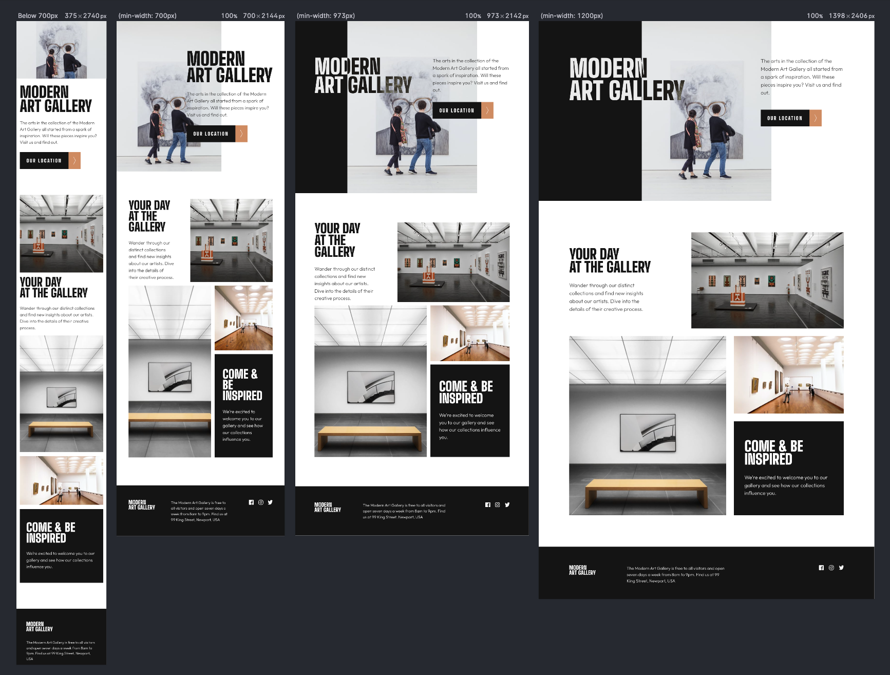

# Frontend Mentor - Art gallery website solution

This is a solution to the [Art gallery website challenge on Frontend Mentor](https://www.frontendmentor.io/challenges/art-gallery-website-yVdrZlxyA). Frontend Mentor challenges help you improve your coding skills by building realistic projects.

## Table of contents

- [Overview](#overview)
  - [The challenge](#the-challenge)
  - [Screenshot](#screenshot)
  - [Links](#links)
- [My process](#my-process)
  - [Built with](#built-with)
  - [What I learned](#what-i-learned)
  - [Continued development](#continued-development)
  - [Useful resources](#useful-resources)
- [Author](#author)
- [Acknowledgments](#acknowledgments)

**Note: Delete this note and update the table of contents based on what sections you keep.**

## Overview
This was an experiment to tie together several technologies and methodologies: CUBE CSS, Every Layout, Utopia and CodyHouse.
### The challenge
Could I apply CUBE CSS, Every Layout, Utopia and CodyHouse to make web development easier and more organized to achieve the following:

- View the optimal layout for each page depending on their device's screen size
- See hover states for all interactive elements throughout the site
- Use [Leaflet JS](https://leafletjs.com/) to create an interactive location map with custom location pin

### Screenshot

### Links

- Solution URL: [https://github.com/helphop/frontend-masters-art-gallery-website](https://github.com/helphop/frontend-masters-art-gallery-website)
- Live Site URL: [https://helphop.github.io/frontend-masters-art-gallery-website/](https://helphop.github.io/frontend-masters-art-gallery-website/)

## My process
I created scss files for layouts from Every Layout. I put these in a directory I called compositions under the css directory.

I downloaded the utilities from CodyHouse. Then I created a utils folder in my project  under the css directory. I extracted the code into files for each type of utility i.e. _typography.scss for any utilities that dealt with typography.

CodyHouse also provides a gulp.js file so I can compile my scss files.
What's also nice is this gulp file uses PurgeCss so I can reduce the size of my final style.css.

I created a directory called 'blocks' under the css directory. This is for the 'B' in CUBE CSS.

Finally I created a global-styles directory. I set the styles that the entire site will use and organized it into specific files, i.e. _breakpoints.scss, _reset.scss, _spacing.scss etc.

I went to https://utopia.fyi/ and used their site to create the typography scales and spacing sizes. I copied the code into css/global-styles/_typography.scss and css/global-styles/_spacing.scss.

I used https://google-webfonts-helper.herokuapp.com/fonts to download the Inter web font so I could self host the font.

I first examine the design of the index page to identify any Composition elements that I can easily code
using the primitives from Every Layout.

I see how the components change for different device sizes.

I setup any utility classes I will need.

I code the HTML first. Then I look at the big picture such as the space between sections, page padding etc.

I code the css from outside starting with mobile size first.

I use a program called Polypane so that I can view all 3 device sizes at the same time.

I try to use CUBE CSS methodology as a way to write my css and the classes I use in my HTML.

Finally as per the wisdom of Andy Bell and Heydon Pickering, coding a site from a design is NOT about pixel perfect results. We have no control over the devise the user will be viewing the website on.  Better to give the browser suggestions as to how to layout the site so that every user has a great experience.  This greatly reduces the amount and complexity of code while keeping the ability to be adaptable.

### Built with

- Semantic HTML5 markup
- CSS custom properties
- Flexbox
- CSS Grid
- CUBE CSS Methodology
- Mobile-first workflow
- Gulp
- PurgeCss
- [Every Layout](https://every-layout.dev/layouts/) - Layout Primitives - C in CUBE CSS
- [CodyHouse Utilities](https://codyhouse.co/ds/docs/framework/utilities) - CSS Framework - U in CUBE CSS
- [Utopia](https://utopia.fyi/) - For fluid typography and spacing
- [Leaflet JS](https://leafletjs.com/) - For interactive maps
- [Glyphhange](https://github.com/filamentgroup/glyphhanger) - to reduce font file size

### What I learned

CUBE CSS methodology is easy to implement and is very helpful in organizing my code.
One of more challenging aspects of programming is naming things. CUBE CSS helps by reducing
the number of classes I need to use to create my layouts.

I learned how to apply a good balance of utility classes without cluttering up the HTML.

There were some 'aha' moments. One especially for the header section of the index page. Using background image and a before element I was able to achieve the look of the design.

I also found that using the primitive layout structures from Every Layout simplified the process of going from design to development. I find I am less overwhelmed with 'how am I going to do this' and more like 'oh that's a stack, and that's a switcher'.

I now understand how to use flexbox and min-height: 100% to
make the website fill all of the vertical space so the footer stays on the bottom of the viewport.

Finally as per the wisdom of Andy Bell and Heydon Pickering, coding a site from a design is NOT about pixel perfect results. We have no control over the devise the user will be viewing the website on.  Better to give the browser suggestions as to how to layout the site so that every user has a great experience.  This greatly reduces the amount and complexity of code while keeping the ability to be adaptable.

### Continued development
I found that this took me a bit longer to complete than I anticipated.

### Useful resources

- [Every Layout](https://every-layout.dev/layouts/) - Layout Primitives - C in CUBE CSS
- [CodyHouse Utilities](https://codyhouse.co/ds/docs/framework/utilities) - CSS Framework - U in CUBE CSS
- [Utopia](https://utopia.fyi/) - For fluid typography and spacing
- [CUBE CSS](https://cube.fyi/) - CUBE CSS methodology explained

## Author
- Frontend Mentor - [@helphop](https://www.frontendmentor.io/profile/helphop)

